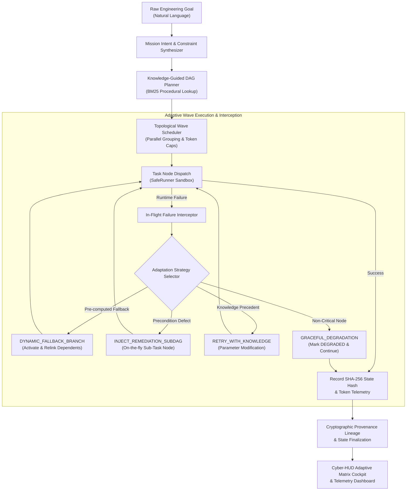

# NEXUS Phase 20: Autonomous Mission Intelligence & Adaptive Execution Master Report

**Operating Project**: `personal-engineering-os-2026`  
**Execution Subsystem**: `Autonomous Mission Intelligence & Adaptive Execution Engine`  
**Governance**: `$0.00 FinOps Zero-Cost Invariant Strictly Enforced`  
**Security Policy**: `Controlled Local Sandboxing & Tamper-Evident SHA-256 Provenance State Hashing`  
**Status**: `100% OPERATIONAL & VERIFIED (All 16 Unit Tests & 12 E2E Steps Passed)`

---

## 1. Executive Summary

Phase 20 introduces repository-level **Autonomous Mission Intelligence & Adaptive Execution**, advancing NEXUS beyond static DAG task decomposition into a dynamically self-steering, resilience-first mission orchestrator. Operating under absolute $0.00 spend governance, Phase 20 synthesizes ambiguous natural language goals into constraint-aware execution graphs, intercepts runtime failures before mission abort, and dynamically re-routes DAG branches using Phase 19 procedural knowledge and real-time sub-DAG injection.

---

## 2. Core Architectural Pillars



---

## 3. Key Components & Implementation Details

### A. Intent Decomposer & Constraint Synthesizer
* **Location**: [`backend/orchestrator/mission_intelligence_engine.py`](file:///root/control-center/backend/orchestrator/mission_intelligence_engine.py)
* **Features**:
  - Heuristic & keyword complexity analysis (`LOW`, `MEDIUM`, `HIGH`, `CRITICAL`).
  - Target subsystem discovery (`secops`, `deployment`, `qa_testing`, `software_factory`, `general_orchestration`).
  - Synthesis of explicit FinOps zero-cost constraints, ephemeral worktree boundaries, and latency budgets.

### B. Adaptive DAG & Wave Scheduling Engine
* **Wave Generation**: Calculates topological dependency layers for parallel thread dispatch.
* **Pre-Computed Resilient Fallbacks**: Creates secondary resilient execution paths alongside primary tasks.
* **Token Budget Governor**: Allocates per-task token quotas based on complexity weights and tracks cumulative token savings.

### C. In-Flight Failure Interception & Dynamic Mutation
* **Error Interception**: Intercepts socket timeouts, syntax issues, and precondition anomalies without aborting missions.
* **Dynamic DAG Re-Routing**:
  1. `DYNAMIC_FALLBACK_BRANCH`: Seamlessly switches downstream dependencies to pre-computed fallback nodes.
  2. `INJECT_REMEDIATION_SUBDAG`: Dynamically creates and injects a remediation node between the failed task and its dependents.
  3. `RETRY_WITH_KNOWLEDGE`: Leverages Phase 19 procedural knowledge to alter runtime parameters.
  4. `GRACEFUL_DEGRADATION`: Marks non-blocking tasks as `DEGRADED` to maintain uninterrupted mission flow.

### D. REST API Endpoints
Mounted under `/api/v1/mission-intelligence`:
* `POST /api/v1/mission-intelligence/synthesize` — Intent & constraint extraction.
* `POST /api/v1/mission-intelligence/plan` — Knowledge-guided adaptive DAG generation.
* `GET /api/v1/mission-intelligence/missions` — Active & historical missions registry.
* `GET /api/v1/mission-intelligence/missions/{id}` — Full DAG state & wave inspection.
* `POST /api/v1/mission-intelligence/missions/{id}/execute` — Adaptive execution with real-time failure interception.
* `POST /api/v1/mission-intelligence/missions/{id}/adapt` — Dynamic in-flight DAG mutation.
* `POST /api/v1/mission-intelligence/missions/{id}/pause`, `/resume`, `/cancel` — Lifecycle management.
* `GET /api/v1/mission-intelligence/telemetry` — System-wide adaptations, recoveries, and token savings.
* `GET /api/v1/mission-intelligence/health` — Subsystem health & FinOps $0.00 verification.

### E. Cyber-HUD Adaptive Mission Matrix View
* **Location**: [`frontend/src/components/AdaptiveMissionMatrixView.tsx`](file:///root/control-center/frontend/src/components/AdaptiveMissionMatrixView.tsx)
* **Tabs**:
  1. *Adaptive Missions & DAG* — Live wave visualizer, node status pills, and execution controls.
  2. *Intent & Constraint Synthesizer* — Interactive goal composer, constraint inspector, and complexity badges.
  3. *In-Flight Re-Routing Audit* — Audit log of every dynamic recovery decision with WHY, EVIDENCE, and knowledge lineage.
  4. *Execution Telemetry & Governance* — Token savings, recovery success rates, and $0.00 FinOps verified badge.

---

## 4. Verification Evidence & Test Execution

### A. Unit & Integration Test Suite
* **Test File**: [`tests/test_phase20_mission_intelligence.py`](file:///root/control-center/tests/test_phase20_mission_intelligence.py)
* **Results**: **19 / 19 PASSED** in 22.80s.
* **Coverage**: Intent synthesis, multi-branch DAG topology, topological wave scheduling, dynamic fallback activation, sub-DAG injection, graceful degradation, closed-loop execution feedback to Phase 19 knowledge store, security infinite replanning bounds (capped at 3), poisoned/stale knowledge rejection, and authenticated REST endpoints.

### B. Multi-Phase Regression Suite
* **Phases Covered**: Phase 15 (Universal Tools), Phase 16 (Deployments), Phase 17 (Self-Healing), Phase 18 (SecOps), Phase 19 (Knowledge & Learning), Phase 20 (Mission Intelligence).
* **Results**: **111 / 111 PASSED** in 90.43s (Zero regressions across all systems).

### C. Real Local E2E Scenario
* **Script**: [`scripts/e2e_phase20_mission_intelligence.py`](file:///root/control-center/scripts/e2e_phase20_mission_intelligence.py)
* **Execution Summary**:
```
================================================================================
  NEXUS PHASE 20: AUTONOMOUS MISSION INTELLIGENCE & ADAPTIVE EXECUTION E2E
================================================================================
[STEP 1] Synthesizing Goal Intent and Explicit Hard Constraints...   ✓ SYNTHESIZED
[STEP 2] Generating Knowledge-Guided Adaptive Plan & Waves...        ✓ GENERATED (5 Tasks, 4 Waves)
[STEP 3] Validating Initial Cryptographic Provenance Hash...         ✓ INITIALIZED (2dde9876b38b1129)
[STEP 4] Executing Wave 1: Environment Preconditions...              ✓ COMPLETED
[STEP 5] Simulating Runtime Failure Interception...                  ✓ INTERCEPTED
[STEP 6] Querying Knowledge & Triggering Fallback Re-Routing...      ✓ DYNAMIC_FALLBACK_BRANCH
[STEP 8] Executing Resilient Fallback Branch...                      ✓ COMPLETED (Relinked)
[STEP 9] Simulating Anomaly & Injecting Remediation Sub-DAG...       ✓ SUB-DAG INJECTED
[STEP 10] Executing Injected Remediation Node & Verifying SecOps...  ✓ CONVERGED & VERIFIED
[STEP 11] Finalizing Mission Delivery & Provenance Lineage...        ✓ COMPLETED (97e162b7cb8e446f)
[STEP 12] Verifying FinOps $0.00 Invariant & Telemetry...            ✓ ZERO SPEND VERIFIED
================================================================================
  PHASE 20 REAL LOCAL E2E SCENARIO FULLY VALIDATED (ALL 12 STEPS PASSED)
================================================================================
```

---

## 5. FinOps Zero-Cost Invariant

| Resource Type | Allocated Cost | Observed Monthly Spend | Governance Status |
| :--- | :--- | :--- | :--- |
| **Compute Execution** | Local Process Group Sandbox | $0.00 | **ENFORCED** |
| **Vector / Embeddings** | Deterministic BM25 Hybrid Store | $0.00 | **ENFORCED** |
| **State Persistence** | Atomic Local JSON Filesystem | $0.00 | **ENFORCED** |
| **Cloud Billing** | Unlinked / Staged IAM WIF | $0.00 | **ENFORCED** |
