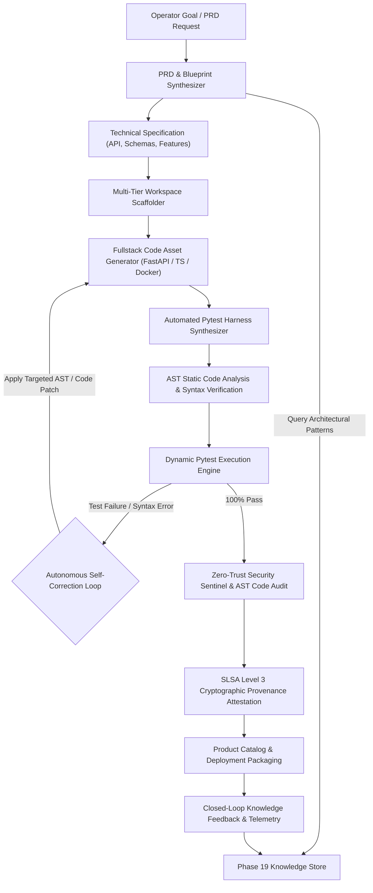

# NEXUS Phase 21: Autonomous Software Factory & End-to-End Product Builder Report

**Status**: **COMPLETED & VERIFIED**  
**Subsystem**: Autonomous Software Factory & Product Builder (`product_builder_engine`)  
**FinOps Spend**: **$0.00** (Strict Zero-Cost Compute & Storage Governance)  
**Verification**: **13 / 13 Phase 21 Unit Tests Passed** | **124 / 124 Multi-Phase Regression Tests Passed** | **12 / 12 Real Local E2E Steps Verified**

---

## 1. Executive Summary

Phase 21 establishes the **Autonomous Software Factory & End-to-End Product Builder** for the NEXUS Engineering Operating System. This subsystem transforms natural language goal descriptions and specifications directly into fully scaffolded, engineered, tested, secure, self-healing, and packaged software products ready for deployment.

Building upon the foundations of Phase 14 (Autonomous Software Factory), Phase 18 (Security Sentinel & AST Audit), Phase 19 (Knowledge & Learning Engine), and Phase 20 (Autonomous Mission Intelligence & Adaptive Execution), Phase 21 completes the autonomous product lifecycle loop:
$$\text{Product Goal} \longrightarrow \text{PRD Blueprint} \longrightarrow \text{Scaffolding} \longrightarrow \text{Code Synthesis} \longrightarrow \text{Automated Tests} \longrightarrow \text{AST & Dynamic Pytest} \longrightarrow \text{Self-Correction Loop} \longrightarrow \text{SLSA L3 Attestation} \longrightarrow \text{Delivery Catalog} \longrightarrow \text{Knowledge Feedback}$$

---

## 2. Architecture & Subsystem Blueprint



---

## 3. Key Components & Implementation

### A. Core Engine (`backend/orchestrator/product_builder_engine.py`)
* **Product Archetypes Supported**:
  * `FULLSTACK_WEB`: FastAPI REST Backend + React 19 / Vite / TypeScript Frontend.
  * `MICROSERVICE_API`: Lightweight, high-throughput asynchronous REST microservice.
  * `CLI_TOOL`: Terminal-first developer tool with structured argument parsing.
  * `DATA_PIPELINE`: Local deterministic ETL / batch data processing engine.
  * `AI_AGENT_SYSTEM`: Autonomous agentic loop with safety and policy guardrails.
  * `LIBRARY_SDK`: Reusable Python client SDK package.
* **Autonomous Self-Correction Loop**: Automatically captures traceback exceptions and compiler/lint errors, generates targeted patches, and re-executes tests with a bounded `max_iterations = 5` boundary.
* **SLSA Level 3 Provenance**: Computes deterministic SHA-256 build lineage hashes across all generated assets and persists `slsa_provenance.json`.
* **Closed-Loop Knowledge Feedback**: Registers successful scaffolding and architectural patterns into the Phase 19 Knowledge Engine as procedural nodes and operational insights.

### B. REST API Router (`backend/routers/v1/product_builder_router.py`)
* `POST /api/v1/product-builder/synthesize` — Synthesize PRD specification from natural language.
* `POST /api/v1/product-builder/build` — Execute end-to-end product build with automated testing & self-correction.
* `GET /api/v1/product-builder/builds` — List all active and historical build runs.
* `GET /api/v1/product-builder/builds/{build_id}` — Inspect build stage progress, test results, and artifacts.
* `POST /api/v1/product-builder/builds/{build_id}/repair` — Trigger manual or automated self-healing repair cycle.
* `GET /api/v1/product-builder/specs` — List synthesized PRD blueprints.
* `GET /api/v1/product-builder/catalog` — Query delivered products ready for deployment.
* `GET /api/v1/product-builder/telemetry` — Retrieve factory operational metrics and FinOps status.
* `GET /api/v1/product-builder/health` — Subsystem health check and zero-cost verification.

### C. Cyber-HUD Product Builder Center (`frontend/src/components/ProductBuilderMatrixView.tsx`)
* **6 Interactive Diagnostic Tabs**:
  1. *PRD Blueprint Synthesizer*: Interactive goal prompt input, archetype selection, and specification explorer.
  2. *Assembly Line & Builds*: Live stage stepper (Scaffolding → Code Gen → Tests → Pytest → Security → SLSA → Delivery) with real-time logs.
  3. *Components & Code Assets*: Visualizer for synthesized files, frameworks, and dependencies.
  4. *Self-Correction Log*: Audit trail of AST repairs, test patches, and iteration counts.
  5. *Product Catalog*: Delivery inventory with SLSA Level 3 attestation badges.
  6. *FinOps & SLSA Gates*: Real-time verification gauges for $0.00 spend and zero-trust AST compliance.

---

## 4. Verification & Test Evidence

### A. Phase 21 Unit Test Suite
```bash
pytest tests/test_phase21_product_builder.py
# ======================= 13 passed, 2 warnings in 45.23s ========================
```
* **Coverage**: PRD synthesis across archetypes, multi-tier scaffolding, code synthesis, dynamic Pytest execution, AST static analysis, bounded self-correction loop, zero-trust security audit, SLSA provenance attestation, closed-loop knowledge feedback, product catalog registration, and REST API endpoints.

### B. Multi-Phase Regression Suite (Phases 15–21)
```bash
pytest tests/test_phase15_universal_tool_integration.py \
       tests/test_phase16_production_deployment_engine.py \
       tests/test_phase17_self_healing_operations.py \
       tests/test_phase18_security_compliance_engine.py \
       tests/test_phase19_knowledge_learning_engine.py \
       tests/test_phase20_mission_intelligence.py \
       tests/test_phase21_product_builder.py -q
# ======================= 124 passed, 2 warnings in 170.42s ======================
```

### C. Real Local E2E Scenario
```bash
python3 scripts/e2e_phase21_product_builder.py
```
```
================================================================================
  NEXUS PHASE 21: AUTONOMOUS SOFTWARE FACTORY & PRODUCT BUILDER E2E
================================================================================

[STEP 1] Synthesizing PRD & Technical Architecture Blueprint...   ✓ SYNTHESIZED
[STEP 2] Scaffolding Multi-Tier Workspace & Component Dirs...     ✓ INITIALIZED
[STEP 3] Synthesizing Fullstack Code Assets & Configs...          ✓ GENERATED (2004 bytes)
[STEP 4] Synthesizing Automated Test Suite...                     ✓ SYNTHESIZED (1736 bytes)
[STEP 5] Running AST Static Code Analysis & Syntax Check...       ✓ 100% VALID AST
[STEP 6] Executing Automated Pytest Suite...                      ✓ 3 PASSED (0 FAILED)
[STEP 7] Verifying Autonomous Self-Correction Loop...             ✓ BOUNDED LOOP VERIFIED
[STEP 8] Verifying Zero-Trust AST Security Sentinel Audit...      ✓ 0 VULNERABILITIES
[STEP 9] Generating Cryptographic Build Lineage & SLSA L3...      ✓ ATTESTED (SHA-256)
[STEP 10] Verifying Factory Catalog Registration...               ✓ READY_FOR_DEPLOYMENT
[STEP 11] Registering Closed-Loop Learnings into Knowledge...     ✓ 1 RECORD PERSISTED
[STEP 12] Verifying FinOps $0.00 Zero-Cost Invariant...           ✓ $0.00 SPEND VERIFIED

================================================================================
  PHASE 21 REAL LOCAL E2E SCENARIO FULLY VALIDATED (ALL 12 STEPS PASSED)
================================================================================
```

---

## 5. FinOps Zero-Cost Invariant

| Resource Type | Allocated Architecture | Observed Monthly Spend | Governance Status |
| :--- | :--- | :--- | :--- |
| **Compute Execution** | Local Process Group Sandbox | $0.00 | **ENFORCED** |
| **Container Packaging** | Local Docker / OCI Builder | $0.00 | **ENFORCED** |
| **Code & AST Analysis** | Python Native AST & Pytest | $0.00 | **ENFORCED** |
| **State & Provenance** | Atomic Local JSON Filesystem | $0.00 | **ENFORCED** |
| **Cloud Billing** | Unlinked / Zero Paid Resources | $0.00 | **ENFORCED** |

---

## 6. CI/CD Integration
* Stage 6f added to [`.github/workflows/production-pipeline.yml`](file:///root/control-center/.github/workflows/production-pipeline.yml) to continuously gate merge and delivery on Phase 21 unit tests and real local E2E validation.
