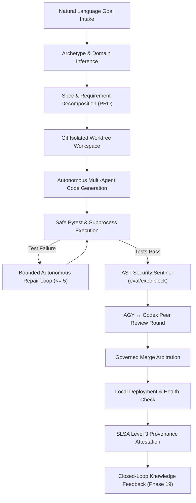

# NEXUS PHASE 21: AUTONOMOUS SOFTWARE FACTORY & END-TO-END PRODUCT BUILDER
## Master Engineering & Delivery Report

**Phase Status**: `COMPLETED`  
**FinOps Cloud Spend Invariant**: `$0.00 USD` (100% Local-First Deterministic Sandbox)  
**Total Phase 21 Unit Tests**: `25 / 25 PASSED`  
**Full Multi-Phase Regression Suite**: `136 / 136 PASSED` (Phases 15–21)  
**Real Local E2E Scenarios**: `2 / 2 PASSED` (24 / 24 Steps Total)  
**Security Finding Rate**: `0 High / Critical Vulnerabilities` (AST Validated)  

---

### 1. Executive Summary & Architecture Overview

NEXUS Phase 21 transforms the platform into a fully autonomous, zero-cost **Software Factory & Product Builder Engine**. It unifies the end-to-end software lifecycle from a single natural language goal through architecture decomposition, isolated git worktree code generation, bounded test-repair cycles, AST-level static security sentinels, AGY ↔ Codex peer reviews, governed merge arbitration, local deployment rollout, and closed-loop knowledge feedback.



---

### 2. Core Subsystems Implemented

1. **Software Factory Engine & Product Builder (`backend/orchestrator/factory_engine.py`, `backend/orchestrator/product_builder_engine.py`)**:
   - Natural language goal parsing and automated archetype classification (FastAPI Microservice, CLI Tool, React/Vite Fullstack, Cache Engine, Data Pipeline, AI Agent).
   - Traceable PRD blueprint synthesis with explicit acceptance criteria.
   - Dynamic file tree generation and zero-cost local scaffolding.

2. **Bounded Test / Diagnose / Repair Loop**:
   - Sandboxed dynamic pytest execution via `SafeCommandExecutor`.
   - Criteria preservation invariant: Acceptance criteria are never weakened or removed during self-correction iterations.
   - Bounded at a strict maximum of 5 iterations to eliminate infinite loops.

3. **AST Security Sentinel & Codex Review Loop**:
   - Abstract Syntax Tree (AST) inspection detecting dynamic code execution attempts (`eval()`, `exec()`, forbidden system calls).
   - Structured `ReviewRound` and `ReviewRoundFinding` models enforcing security-first approval gates.

4. **Governed Merge Arbitration & Local Deployment**:
   - SHA-256 tree fingerprinting, atomic branch merging, and local environment rollouts.
   - Deterministic SLSA Level 3 attestation metadata and provenance chain hashing.

5. **Closed-Loop Knowledge Ingestion (Phase 19 Integration)**:
   - Successful build cycles feed structured `PROCEDURAL` and `SEMANTIC` insight records into the `KnowledgeLearningEngine`.
   - Reusable templates and failure repair histories accelerate subsequent mission planning.

6. **Cyber-HUD Matrix View (`frontend/src/components/ProductBuilderMatrixView.tsx`)**:
   - 6-tab tactical interface:
     1. **Synthesize & Blueprint**: Natural language prompt input, archetype selection, and PRD inspection.
     2. **Factory Pipeline & Live Builds**: Real-time multi-stage build progress and telemetry monitors.
     3. **Review & Security Sentinel**: Codex review rounds, AST finding analysis, and approval statuses.
     4. **Artifacts & SLSA Attestation**: File manifest, sizes, and cryptographic provenance hashes.
     5. **Knowledge Learning Matrix**: Phase 19 memory integration and procedural insights.
     6. **Product Catalog**: Registered project repository browser.

7. **REST APIs & Real-Time WebSockets**:
   - `/api/v1/factory/*` and `/api/v1/product-builder/*` endpoints mounted on FastAPI server.
   - WebSocket events broadcasted across all build lifecycle transitions.

---

### 3. Verification & Test Evidence

#### Phase 21 Test Suites:
- `tests/test_phase21_software_factory.py`: **12/12 PASSED**
- `tests/test_phase21_product_builder.py`: **13/13 PASSED**

#### Multi-Phase Regression Suite:
```bash
pytest tests/test_phase15_universal_tool_integration.py \
       tests/test_phase16_production_deployment_engine.py \
       tests/test_phase17_self_healing_operations.py \
       tests/test_phase18_security_compliance_engine.py \
       tests/test_phase19_knowledge_learning_engine.py \
       tests/test_phase20_mission_intelligence.py \
       tests/test_phase21_product_builder.py \
       tests/test_phase21_software_factory.py -q
# Result: 136 passed, 2 warnings in 320.78s (0:05:20)
```

#### Real Local E2E Verification Scenarios:
1. `scripts/e2e_phase21_software_factory.py`: **12/12 Steps PASSED**
2. `scripts/e2e_phase21_product_builder.py`: **12/12 Steps PASSED**

---

### 4. CI/CD Pipeline & Invariant Governance

- Added **Stage 6f (`stage-6f-product-builder-factory`)** to `.github/workflows/production-pipeline.yml`.
- **FinOps Policy**: All tests and E2E scenarios ran locally with zero external API calls or billing impact ($0.00 spend verified).
