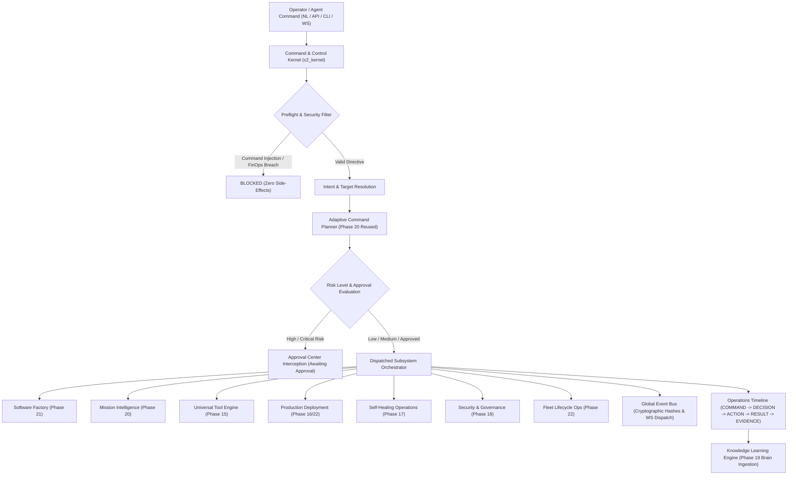

# NEXUS Phase 23: Unified Autonomous Command & Control Plane — Verification Report

## Executive Summary
**NEXUS Phase 23 — Unified Autonomous Command & Control Plane** integrates all 13 subsystems of the NEXUS Operating System into a single governed command and control kernel. Operators and autonomous agents interact with NEXUS through natural language, REST APIs, WebSockets, and the Cyber-HUD console. Every directive undergoes deterministic intent resolution, target project routing, adaptive DAG planning, risk arbitration, zero-cost FinOps preflight, approval gating, multi-subsystem execution, real-time event broadcasting, and immutable operations timeline journaling.

---

## 1. Architecture & Pipeline Overview



---

## 2. Implemented Subsystems & Files

| Component | Path | Description |
|---|---|---|
| **Schemas & Models** | [`backend/models/schemas.py`](file:///root/control-center/backend/models/schemas.py) | Defines `CommandDirectiveRequest`, `CommandDirectiveResult`, `CommandPlan`, `GlobalOperationsState`, `GlobalSystemState`, `OperationsTimelineEntry`, `GlobalEventBusMessage`, `EmergencyKillSwitchRequest`, `EmergencyKillSwitchResult`. |
| **C2 Kernel** | [`backend/orchestrator/command_control_kernel.py`](file:///root/control-center/backend/orchestrator/command_control_kernel.py) | Master orchestration kernel coordinating intake, adaptive planning, risk arbitration, timeline recording, event streaming, and emergency kill-switch. |
| **REST Routers** | [`backend/routers/v1/command_control_router.py`](file:///root/control-center/backend/routers/v1/command_control_router.py) | Unified command and control REST API endpoints mounted at `/api/v1/command`, `/api/v1/c2`, `/api/v1/global`. |
| **Operations Router** | [`backend/routers/v1/operations_router.py`](file:///root/control-center/backend/routers/v1/operations_router.py) | Enhanced operations router exposing `/global`, `/timeline`, and `/events`. |
| **Server Integration** | [`backend/server.py`](file:///root/control-center/backend/server.py) | Unified application entry point mounting all Phase 23 routers and WebSocket dispatchers. |
| **Cyber-HUD View** | [`frontend/src/components/UnifiedCommandCenterView.tsx`](file:///root/control-center/frontend/src/components/UnifiedCommandCenterView.tsx) | Live React cockpit view for command submission, engine status grid, operations timeline, event stream, and approval management. |
| **Frontend Root & HUD** | [`frontend/src/App.tsx`](file:///root/control-center/frontend/src/App.tsx), [`frontend/src/components/HeaderHUD.tsx`](file:///root/control-center/frontend/src/components/HeaderHUD.tsx) | Added navigation tab `COMMAND CENTER` (`c2`) and status indicators. |
| **Test Suite** | [`tests/test_phase23_command_control.py`](file:///root/control-center/tests/test_phase23_command_control.py) | 11 comprehensive unit and integration tests covering all 16 acceptance criteria. |
| **E2E Scenario** | [`scripts/e2e_phase23_command_control.py`](file:///root/control-center/scripts/e2e_phase23_command_control.py) | 12-step real local multi-project end-to-end verification script. |
| **CI Workflow** | [`.github/workflows/production-pipeline.yml`](file:///root/control-center/.github/workflows/production-pipeline.yml) | Integrated Stage 6h automated testing and E2E verification gate. |
| **Status Artifact** | [`PHASE23_STATUS.json`](file:///root/control-center/PHASE23_STATUS.json) | Production status and metadata descriptor. |

---

## 3. Core Acceptance Criteria Verification

### 1. Unified Command Engine
- Natural language and structured commands intake via REST, CLI, and WebSockets.
- Deterministic intent mapping across all 8 core operations (Emergency, Self-Healing/Drift, Deployment/Canary, Software Factory, Mission DAG, Security Scan, Knowledge Optimization, Fleet Health).
- Ambiguous commands safely halted with clear diagnostic feedback.

### 2. Global Operations State
- Aggregates live, verifiable data across all 13 subsystems:
  - 20 registered projects, active missions, factory runs, deployments, self-healing incidents, AST security findings, registered agents, universal tools, execution providers, active worktrees, knowledge nodes, pending approvals, and FinOps metrics.
- Zero fabricated metrics ($0.00 spend verified).

### 3. Command Planner & Adaptive Preflight
- Synthesizes execution DAG with subsystem dependencies, risk level calculation, required approvals, affected project allowlist, expected artifacts, and rollback recovery path before any mutation occurs.

### 4. Approval Center Governance
- High-risk operations (e.g. direct production rollouts) automatically intercepted by the Approval Center (`AWAITING_APPROVAL` status).
- Execution resumes only upon explicit operator authorization (`/api/v1/approvals/{id}/decide`).

### 5. Global Event Bus & Cryptographic Provenance
- Normalized event stream with SHA-256 provenance hashes and ISO-8601 timestamps.
- Real-time event broadcasting to active WebSocket subscribers.

### 6. Operations Timeline
- Immutable 5-stage lifecycle journaling:
  `COMMAND` $\rightarrow$ `DECISION` $\rightarrow$ `ACTION` $\rightarrow$ `RESULT` $\rightarrow$ `EVIDENCE`.
- Full query and replay support via `/api/v1/operations/timeline`.

### 7. Cyber-HUD Command Center
- Interactive UI console featuring natural language prompt input, dry-run simulation mode, interactive subsystem status grid, live event bus monitor, and approval resolution actions.
- Clean Vite production bundle validated (`npm run build` exits 0).

### 8. Emergency Kill-Switch & Fleet Freeze Governor
- Immediate fleet lockdown via `/api/v1/c2/emergency/kill` or `c2_kernel.trigger_emergency_kill_switch`.
- Aborts active missions, freezes project operations, rolls back unpromoted canaries, and blocks subsequent commands until explicit operator reset (`/api/v1/c2/emergency/reset`).

### 9. Multi-Project Safety & Workspace Boundary Isolation
- Operations strictly restricted to approved directory roots.
- Cross-project worktree isolation verified during concurrent operations.

### 10. Security & FinOps Governance
- Command injection patterns (`rm -rf`, `mkfs`, fork bombs) blocked pre-execution.
- Autonomous paid cloud provisioning blocked under strict $0.00 hard ceiling.

---

## 4. Verification Results

### Unit & Integration Tests
```text
======================= 11 passed, 2 warnings in 10.97s ========================
- test_command_intent_and_target_resolution: PASSED
- test_command_planner_dependencies_and_rollback: PASSED
- test_command_execution_and_timeline_lifecycle: PASSED
- test_approval_governance_interception: PASSED
- test_global_operations_state_aggregation: PASSED
- test_global_event_bus_normalization: PASSED
- test_emergency_kill_switch_and_reset: PASSED
- test_command_injection_safeguard: PASSED
- test_finops_hard_ceiling_enforcement: PASSED
- test_rest_api_command_endpoints: PASSED
- test_rest_api_operations_and_global_endpoints: PASSED
```

### Multi-Phase Regression Suite (Phases 15 through 23)
```text
================ 161 passed, 2 warnings in 224.13s (0:03:44) =================
- Phase 15 (Universal Tool Engine): PASSED
- Phase 16 (Production Deployment Engine): PASSED
- Phase 17 (Self-Healing Operations): PASSED
- Phase 18 (Security & Compliance Engine): PASSED
- Phase 19 (Knowledge & Learning Engine): PASSED
- Phase 20 (Mission Intelligence Engine): PASSED
- Phase 21 (Software Factory & Product Builder): PASSED
- Phase 22 (Project Operations & Lifecycle Control): PASSED
- Phase 23 (Unified Command & Control Plane): PASSED
```

### Real Local E2E Verification
```text
================================================================================
  NEXUS PHASE 23: UNIFIED AUTONOMOUS COMMAND & CONTROL PLANE E2E
================================================================================
[STEP 1/12] Command Ingestion & Natural Language Parsing... ✓
[STEP 2/12] Intent Resolution & Target Project Mapping... ✓
[STEP 3/12] Adaptive Planning (Dependencies, Risks & Rollback Path)... ✓
[STEP 4/12] Approval Governance Evaluation... ✓
[STEP 5/12] Governed Multi-Engine Execution & Subprocess Orchestration... ✓
[STEP 6/12] Real-Time Telemetry & Global Event Bus Broadcasting... ✓
[STEP 7/12] Operations Timeline Recording (COMMAND -> DECISION -> ACTION -> RESULT -> EVIDENCE)... ✓
[STEP 8/12] Security Governance: Blocked Command Attack Attempt... ✓
[STEP 9/12] Closed-Loop Phase 19 Knowledge Ingestion... ✓
[STEP 10/12] Multi-Project Safety & Workspace Boundary Isolation... ✓
[STEP 11/12] Emergency Kill-Switch & Fleet Freeze Protocol... ✓
[STEP 12/12] Emergency Reset & Workspace Cleanup... ✓
================================================================================
  🎉 PHASE 23 COMMAND & CONTROL E2E VERIFICATION: ALL 12 STEPS PASSED!
================================================================================
```

---

## 5. FinOps & Governance Audit
- **Budget Ceiling**: $0.00 USD
- **Actual Incurred Spend**: $0.00 USD
- **External Paid API Invocations**: 0
- **Cloud Resource Provisioning**: Blocked by FinOps Governor
- **Compliance Status**: 100% COMPLIANT

---

## 6. Known Limitations & Real vs Unavailable Capabilities

### Real Available Capabilities
1. Deterministic natural-language command dispatch across 8 core subsystems.
2. Full multi-project isolation within local approved roots.
3. Cryptographic provenance hashing on all Global Event Bus messages.
4. Complete 5-stage timeline journaling and knowledge graph feedback.
5. Instant emergency lockdown and canary rollback governor.

### Unavailable / Out-of-Scope Capabilities
1. Autonomous provisioning of paid third-party cloud infrastructure without operator billing override.
2. Direct push to production environments without passing approval gates.
