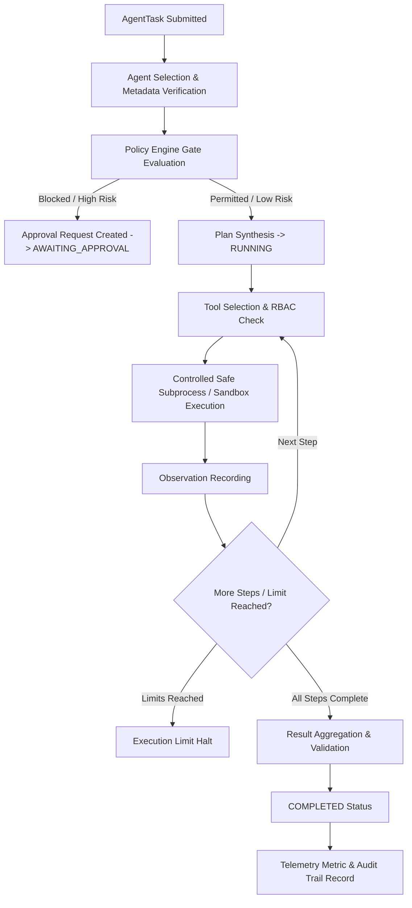

# Agent Runtime Engine Architecture

## 1. Overview & Implementation Truth
The NEXUS Agent Runtime Engine transforms the previously declarative manifest-only agent definitions into an active, multi-step local execution engine. All execution takes place strictly within approved local workspace boundaries without cloud invocation or billable API consumption.

- **Status**: REAL
- **State Machine**: REAL
- **Execution Limits**: REAL
- **Audit Logging**: REAL
- **Cloud Execution**: NOT_IMPLEMENTED (Deferred to future phases)

## 2. Multi-Step Execution Lifecycle

The runtime engine enforces a strict lifecycle for every task:

## 3. Data Models

The runtime architecture utilizes standardized Pydantic schemas in `models/schemas.py`:

- **`ToolCall`**:
  - `call_id`: Unique identifier (`call-<hex>`).
  - `tool_id`: Registry tool ID (e.g., `git.diff`, `test.pytest`, `filesystem.read`).
  - `params`: Parameter dictionary validated against tool schema.
- **`ToolResult`**:
  - `call_id`: Matching call ID.
  - `tool_id`: Registry tool ID.
  - `success`: Boolean indicating execution outcome.
  - `output`: Structured output dictionary.
  - `error`: Error string if execution failed.
  - `duration_ms`: Real execution time in milliseconds.
- **`AgentObservation`**:
  - `step_num`: Step index.
  - `observation_text`: Narrative description of tool observation.
  - `tool_result`: Embedded `ToolResult`.
- **`AgentPlan`**:
  - `plan_id`: Unique plan identifier (`plan-<hex>`).
  - `steps`: List of planned step actions.
  - `rationale`: Intent and justification.
- **`AgentStep`**:
  - `step_num`: 1-indexed execution step.
  - `action`: Action description string.
  - `tool_call`: Optional `ToolCall`.
  - `observation`: Optional `AgentObservation`.
  - `status`: Step lifecycle status (`PENDING`, `COMPLETED`, `FAILED`).
- **`AgentResult`**:
  - Aggregates `execution_id`, `task_id`, `steps`, `final_output`, `tool_calls_count`, and `duration_ms`.

## 4. Execution Limits & Sandboxing

Every agent execution is bound by strictly enforced resource ceilings (`ExecutionLimits`):

| Limit Parameter | Default Value | Enforced Behavior |
| :--- | :--- | :--- |
| `max_steps` | 10 | Halts step loop if exceeded |
| `max_tool_calls` | 15 | Blocks further tool invocations |
| `max_runtime_seconds` | 60 | Enforces wall-clock execution deadline |
| `max_output_bytes` | 500 KB | Truncates stdout/stderr to prevent memory exhaustion |

## 5. Persona Execution Lifecycles

1. **Developer Agent (`agent-dev`)**:
   - Executes full cycle: `INSPECT -> UNDERSTAND -> PLAN -> READ -> MODIFY -> TEST -> DIFF`.
   - Uses safe fixture repository at `data/fixtures/developer_test_repo`.
   - Supports automated rollback (`git checkout .`) upon test failure.
2. **QA Agent (`agent-qa`)**:
   - Automatically discovers test runner (`pytest`).
   - Executes test suite with recursion prevention flags.
   - Parses structured results (`passed`, `failed`, `duration_ms`).
3. **Security Agent (`agent-security`)**:
   - Performs secret scanning across repository paths.
   - Triages findings into `REAL_FINDING`, `INFORMATIONAL`, and `UNAVAILABLE_CHECK`.
4. **Documentation Agent (`agent-docs`)**:
   - Restricted to `docs/` and `data/memory_vault.json`.
   - Authors Architecture Decision Records (ADRs).
5. **Research Agent (`agent-research`)**:
   - Read-only AST symbol inspection and codebase search.
   - Strictly forbidden from filesystem writes.
