# NEXUS Phase 7: Local Production Hardening & Adversarial Reliability Report

## 1. Executive Summary

Phase 7 transitioned NEXUS from an autonomous multi-agent swarm prototype to an **adversarially hardened, locally resilient personal engineering operating system**. The work focused strictly on local system correctness, concurrency safety, state-machine integrity, circular loop defense, process lifecycles, and zero-downtime execution under host constraints.

All operations were conducted exclusively inside `/root/control-center` with **$0.00 cloud spend**, billing accounts unlinked, zero real secrets exposed, and all user data preserved.

```mermaid
flowchart TD
    subgraph Host["Host Operating System (Linux)"]
        Daemon["nexus_daemon.py / eco daemon"]
        FastAPI["FastAPI Control Plane (Lifespan Context)"]
        Daemon -->|Supervises / Health Probes| FastAPI
    end

    subgraph StateMachine["AGY ↔ Codex State Engine"]
        Init["INITIALIZING"] --> Spec["SPEC_PROPOSAL"]
        Init --> Appr["AWAITING_APPROVAL"]
        Appr -->|Resumes Post-Approval| Spec
        Spec --> Code["CODE_SYNTHESIS"]
        Code --> QA["TEST_VERIFICATION"]
        QA -->|Assertions Failed| Remed["FEEDBACK_REVISION (Context Injected)"]
        Remed -->|Remediation Loop| Code
        QA -->|Assertions Passed| Sec["SECURITY_AUDIT"]
        Sec -->|Clean| Done["COMPLETED (Terminal)"]
        QA -->|Exhausted Revisions| Rollback["ROLLED_BACK (Terminal)"]
    end

    subgraph Storage["Storage Engine (backend/core/storage.py)"]
        Atomic["atomic_save_json / atomic_json_updater"]
        RLock["In-Memory RLock Registry"]
        Flock["Cross-Process fcntl.flock (Re-entrant)"]
        Quarantine["Forensic Corruption Quarantine (*.corrupt.*)"]
        Atomic --- RLock
        Atomic --- Flock
        Atomic --- Quarantine
    end
```

---

## 2. Deep Dive: Key Capabilities Hardened & Implemented

### 2.1 Database & Atomic Storage Resilience
- **Re-entrant File Locking**: Addressed a critical POSIX `fcntl.flock` re-entrancy hazard where nested context manager invocations deadlocked. Implemented `threading.local()` depth tracking coupled with per-path `threading.RLock()` synchronization.
- **Transactional Read-Modify-Write Context Manager**: Added `atomic_json_updater(filepath, default=...)` enabling concurrent threads to safely execute read-modify-write workflows without race conditions or lost updates.
- **Forensic Corruption Quarantine**: Enhanced `load_json_safe()` so that damaged, truncated, or malformed JSON files are automatically snapshotted to `<filepath>.corrupt.<iso_timestamp>` before falling back to defaults, preventing silent data loss during subsequent atomic saves.

### 2.2 AGY ↔ Codex State-Machine DAG Integrity
- **Transition DAG Enforcement**: Implemented `VALID_STATE_TRANSITIONS` in `SessionEngine`. Rejects illegal state jumps (e.g. attempting to jump from `INITIALIZING` straight to `COMPLETED`, or skipping `TEST_VERIFICATION` before `SECURITY_AUDIT`).
- **Terminal State Lock**: Enforced terminal finality for `COMPLETED` and `ROLLED_BACK` sessions. Further mutation attempts raise explicit `ValueError` exceptions.
- **In-Flight Session Concurrency Lock**: Added process-level lock registry (`_executing_sessions`) preventing simultaneous execution attempts on the same session from competing threads or API requests.
- **Idempotency**: Calling `execute_session()` on an already `COMPLETED` or `ROLLED_BACK` session returns immediately without resetting steps or re-running sub-agent lifecycles.
- **Session Resumability Post-Human Approval**: Sessions halted in `AWAITING_APPROVAL` can be resumed cleanly post-approval, picking up execution at `SPEC_PROPOSAL` without restarting or losing history.
- **Multi-Turn Remediation Context**: On verification failure, `session.last_feedback` captures the exact QA or security errors and injects them into the coder agent's synthesis instructions, closing the autonomous feedback loop.
- **Stale / Corrupt Session Record Preservation**: `SessionEngine._load_sessions()` quarantines non-dict / corrupt entries in memory and preserves them during `_persist_sessions()`, preventing partial corruption from wiping historical sessions.

### 2.3 Agent Handoff Safety Guardrails
- **Parent Agent Identity Validation**: Verifies that `parent_agent_id` exists in the registered agent fleet before executing handoff.
- **Circular Handoff Loop Detection**: Tracks the delegation `call_chain` across parent-child contexts. Immediately blocks direct self-delegation (`parent == target`) and indirect circular recursion (e.g., `agent-dev -> agent-qa -> agent-dev`). Emits a `CIRCULAR_HANDOFF_BLOCKED` audit event.
- **RBAC Delegation & Privilege Escalation Defense**: Prevents read-only inquiry agents (`agent-research`, `agent-docs`, `agent-seo`) from delegating directly to destructive agents (`agent-recovery`) without operator approval.
- **Correlation Propagation**: Passes `parent_execution_id`, `handoff_id`, and `correlation_id` across audit records and child execution contexts.

### 2.4 FastAPI Lifespan Modernization & Graceful Shutdown
- Modernized `backend/server.py` from deprecated `@app.on_event("startup")` / `@app.on_event("shutdown")` to the Starlette/FastAPI `lifespan(app: FastAPI)` async context manager.
- Eliminated 466 deprecation warnings.
- Background telemetry and automations loops are tracked, cancelled, and awaited cleanly during SIGTERM / SIGINT shutdown.

### 2.5 Local Production Daemon & CLI Supervisor
- Created [`scripts/nexus_daemon.py`](file:///root/control-center/scripts/nexus_daemon.py) managing background uvicorn processes via PID file (`data/nexus.pid`) and detached sessions.
- Supported CLI commands: `start`, `stop`, `restart`, `status`, `logs [N]`.
- Implemented startup health probing (verifies `/api/health` responsiveness before declaring success).
- Integrated `eco daemon` into [`eco`](file:///root/control-center/eco) with user guidance when the daemon is offline.

### 2.6 Subprocess Test Storm Optimization
- Added `--ignore=tests/test_phase6_*.py` and `--ignore=tests/test_phase7_*.py` to `backend/routers/v1/projects.py` and `backend/orchestrator/tool_runner.py`.
- Prevented nested pytest subprocess runs from recursively executing heavy end-to-end swarm tests.
- Reduced project test runtime from ~50 seconds to under 10 seconds.

---

## 3. Test & Verification Results

### 3.1 Full Repository Regression Test Suite
- **Result**: **189 passed / 189 total (100% PASSING)**
- **Test Suites**: 18
- **Execution Time**: 108.16s (~1m 48s, down from 3m 00s in Phase 6)
- **Deprecation Warnings**: Reduced from 468 to 2 (only Starlette TestClient standard deprecations remain)

| Test Suite File | Test Count | Status | Description |
|---|:---:|:---:|---|
| `tests/test_agent_runtime.py` | 21 | PASS | Agent tool execution, RBAC, AST tools |
| `tests/test_agents.py` | 2 | PASS | Agent registry, schema validation |
| `tests/test_api.py` | 13 | PASS | REST endpoints, projects, health |
| `tests/test_approvals.py` | 2 | PASS | Human approval tokens, decisions |
| `tests/test_control_plane_security.py` | 12 | PASS | Token guessing, replay, TTL, auth |
| `tests/test_cost_guard.py` | 3 | PASS | Zero-spend guardrail, unlinked billing |
| `tests/test_hardening_and_execution.py` | 6 | PASS | Subprocess pytest runner, regex scanner |
| `tests/test_phase4_autonomous_core.py` | 6 | PASS | Autonomous core, atomic JSON, ADR |
| `tests/test_phase5_adversarial.py` | 24 | PASS | Shell injection, symlink escapes, memory caps |
| `tests/test_phase5_deep_audit.py` | 28 | PASS | Cross-agent escalation, step limits |
| `tests/test_phase5_isolation.py` | 19 | PASS | Process groups, env sanitization |
| `tests/test_phase5_reliability.py` | 6 | PASS | Circuit breaker, corrupt JSON resilience |
| `tests/test_phase6_agy_codex_orchestration.py` | 7 | PASS | AGY ↔ Codex sessions, feedback loops, rollbacks |
| `tests/test_phase6_swarm_and_packaging.py` | 19 | PASS | 13 agent lifecycles, handoffs, Docker, IaC |
| **`tests/test_phase7_production_hardening.py`** | **14** | **PASS** | **Flock concurrency, DAG integrity, resumability, daemon** |
| `tests/test_policy.py` | 5 | PASS | Policy engine, destructive approval gates |
| `tests/test_secrets.py` | 2 | PASS | Multi-pattern regex secret masking |
| **TOTAL** | **189** | **100%** | **Clean execution across entire OS** |

### 3.2 Pre-Flight CI Gatekeeper (`scripts/ci_verify.py`)
All 8 verification stages passed with zero warnings or errors:
1. `Python Compilation & Syntax Audit`: 44 modules compiled cleanly.
2. `Multi-Pattern Secret Leak Audit`: 0 static credentials detected.
3. `Container Packaging & Non-Root User Audit`: Non-root `1000:1000`, tmpfs sandboxing verified.
4. `Cloud Readiness & IaC Manifest Audit`: WIF keyless architecture & Cloud Run manifests verified.
5. `FinOps Zero-Spend Guardrail Audit`: Spend $0.00, billing unlinked.
6. `Agent Fleet & Specialized Lifecycles Audit`: 13 specialized agents authorized for handoffs.
7. `Automated Fast Regression Tests`: All fast unit and integration tests passed.
8. `Local Production Hardening & Daemon Control Audit`: `nexus_daemon.py` operational, lifespan active, 14/14 Phase 7 tests passed.

---

## 4. Exact Files Modified & Created

### Modified Files:
- [`backend/server.py`](file:///root/control-center/backend/server.py): Implemented Starlette `lifespan` context manager, graceful scheduler task cancellation, and timezone-aware UTC timestamps.
- [`backend/core/storage.py`](file:///root/control-center/backend/core/storage.py): Implemented re-entrant flock tracking, thread-level RLock registry, `atomic_json_updater` context manager, and forensic corruption quarantine.
- [`backend/orchestrator/session_engine.py`](file:///root/control-center/backend/orchestrator/session_engine.py): Implemented strict DAG transition matrix, in-flight concurrency lock, post-approval resumability, remediation context injection, and corrupt session preservation.
- [`backend/orchestrator/runtime.py`](file:///root/control-center/backend/orchestrator/runtime.py): Implemented parent agent validation, circular handoff detection, RBAC privilege escalation prevention, and correlation ID propagation.
- [`backend/routers/v1/projects.py`](file:///root/control-center/backend/routers/v1/projects.py): Added Phase 6 & Phase 7 test ignores to subprocess pytest execution.
- [`backend/orchestrator/tool_runner.py`](file:///root/control-center/backend/orchestrator/tool_runner.py): Added Phase 7 test ignore to QA pytest runner.
- [`backend/models/schemas.py`](file:///root/control-center/backend/models/schemas.py): Added `last_feedback` attribute to `AgyCodexSession`.
- [`backend/core/audit.py`](file:///root/control-center/backend/core/audit.py): Cleaned up timezone deprecations and ensured strict signature alignment.
- [`backend/core/observability.py`](file:///root/control-center/backend/core/observability.py): Cleaned up timezone deprecations.
- [`backend/routers/v1/overview.py`](file:///root/control-center/backend/routers/v1/overview.py): Cleaned up timezone deprecations.
- [`backend/registry/projects.py`](file:///root/control-center/backend/registry/projects.py): Cleaned up timezone deprecations.
- [`backend/routers/v1/cloud_router.py`](file:///root/control-center/backend/routers/v1/cloud_router.py): Cleaned up timezone deprecations.
- [`backend/integrations/adapters/termux_adapter.py`](file:///root/control-center/backend/integrations/adapters/termux_adapter.py): Cleaned up timezone deprecations.
- [`eco`](file:///root/control-center/eco): Added `eco daemon` command and helpful error guidance when control plane is stopped.
- [`scripts/ci_verify.py`](file:///root/control-center/scripts/ci_verify.py): Added stage 8 verifying local production hardening and daemon lifecycle.

### Created Files:
- [`scripts/nexus_daemon.py`](file:///root/control-center/scripts/nexus_daemon.py): Local production daemon process supervisor with health probing, PID file tracking, and graceful signal trapping.
- [`tests/test_phase7_production_hardening.py`](file:///root/control-center/tests/test_phase7_production_hardening.py): 14 comprehensive adversarial tests covering storage concurrency, DAG integrity, resumability, and circular loops.
- [`PHASE7_STATUS.json`](file:///root/control-center/PHASE7_STATUS.json): Phase 7 status manifest.
- [`docs/operations/PHASE7_HARDENING_REPORT.md`](file:///root/control-center/docs/operations/PHASE7_HARDENING_REPORT.md): This technical document.

---

## 5. Genuine Remaining Limitations & Technical Boundaries

1. **Simulated External AI Providers**: Real tool execution (git, pytest, ast, disk, secrets, metrics) is 100% real host execution; however, external LLM providers (Gemini, Claude, OpenAI) remain simulated or report `NOT_CONFIGURED` when API keys are omitted. This strictly preserves provider neutrality and zero-spend constraints.
2. **Git Workspace Single-Branch Working Tree**: Because git commands run against real workspace working trees, multiple concurrent sessions targeting the same workspace repository must be scheduled sequentially to avoid uncommitted file collision.
3. **Keyless Cloud Run Remote Deployment**: Static infrastructure manifests (Terraform, Docker) are 100% valid and verified, but live remote deployment to GCP Cloud Run remains disabled until an external operator links a billing account and configures live credentials.

---

## 6. Recommended Next Objectives

1. **Persistent Workspace Worktree Isolation**: Introduce Git worktrees (`git worktree add`) for each autonomous session, allowing completely parallel multi-branch development across concurrent sessions in the same project without working tree collisions.
2. **Web UI Cyber-HUD Hardening**: Connect the frontend Cyber-HUD to the new `eco daemon` endpoints and session resumability APIs, displaying live state machine transitions and audit trails in real-time.
3. **Local SQLite / DuckDB Metadata Cache**: For high-volume multi-year audit history, complement the atomic JSON storage engine with an embedded zero-configuration SQLite or DuckDB reader.
