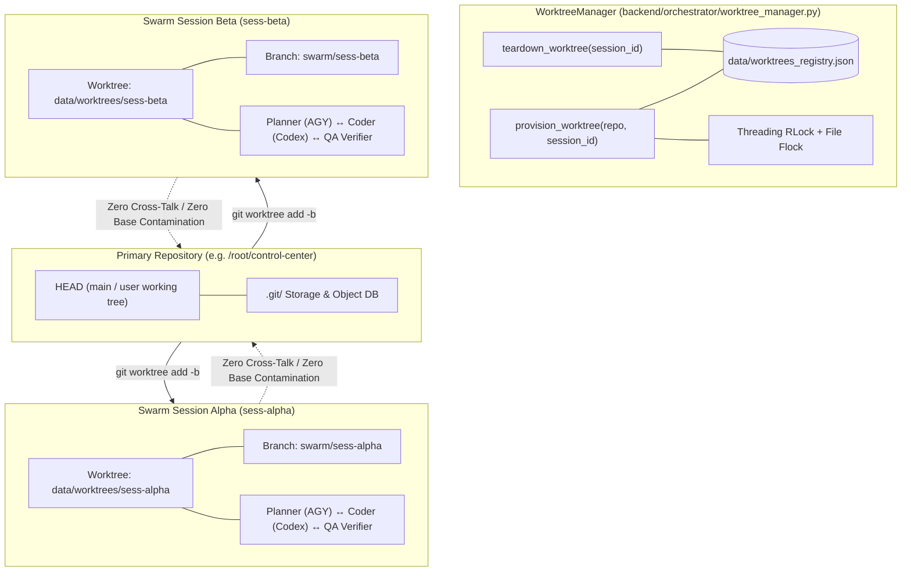

# NEXUS Phase 8: Isolated Git Worktree Swarm Execution Report

## 1. Executive Summary

Phase 8 definitively eliminates the single highest-value limitation identified in the NEXUS autonomous engineering control plane: **Git Working Tree Single-Branch Concurrency**.

Previously, concurrent multi-agent swarm sessions targeting the same workspace repository had to be scheduled sequentially or risked catastrophic working tree collisions, index lock races, uncommitted file overwrites, and polluted regression tests.

Phase 8 introduces **production-grade per-session Git worktree isolation**. Each swarm session executes against a native Git worktree on a dedicated branch (`swarm/<session_id>`), completely isolated from the primary repository's working tree and other concurrent swarm sessions.

All operations were executed strictly inside `/root/control-center` with **$0.00 cloud spend**, billing unlinked, no live cloud resource mutation, zero secret exposure, and all existing user changes strictly preserved.

---

## 2. Architecture & Implementation Details

### 2.1 Core Worktree Manager (`backend/orchestrator/worktree_manager.py`)
- **Git Worktree Engine**: Utilizes native `git worktree add -b <branch> <path> HEAD` and `git worktree remove --force <path>` with `git worktree prune`.
- **Thread & Cross-Process Synchronization**: Uses an internal `threading.RLock()` across all provisioning, teardown, and pruning methods, combined with `atomic_json_updater` for persistent registry state tracking (`data/worktrees_registry.json`).
- **Path Traversal Defenses**:
  - `session_id` validation strictly enforces `^[a-zA-Z0-9_\-]+$`, rejecting directory traversal payloads (`../../etc`, evil subpaths, null bytes, shell metacharacters).
  - Canonical path resolution enforces that worktrees reside strictly within `data/worktrees/`.
  - Rejects protected system roots (`/`, `/root`, `/etc`, `/var`, `/usr`).
- **Base Branch Safety Guardrails**:
  - Checks current active branch on the base repository (`git rev-parse --abbrev-ref HEAD`).
  - Prohibits checking out or deleting the active base branch.
  - Generates unique feature branches per session (`swarm/{session_id}`).
- **Idempotency & Stale Pruning**:
  - Re-requesting provisioning for an active session returns the existing valid worktree without duplicating directories or branches.
  - `prune_stale_worktrees()` audits the worktree directory against the registry, safely pruning untracked or abandoned worktree directories and calling `git worktree prune`.
- **Ephemeral Context Manager**:
  - `isolated_worktree_context(repo_path, session_id)` enables scoped block execution with guaranteed automatic teardown and optional branch cleanup upon exit.

### 2.2 Session Engine Integration (`backend/orchestrator/session_engine.py`)
- **Schema Extensions**: Added `isolate_worktree: bool`, `auto_cleanup_worktree: bool`, `isolated_worktree: Optional[str]`, and `worktree_branch: Optional[str]` to `AgyCodexSessionRequest` and `AgyCodexSession`.
- **Lifecycle Integration**:
  - When `session.isolate_worktree` is enabled, `SessionEngine._run_workflow` automatically provisions the worktree upon entry.
  - Sets `effective_workspace = session.isolated_worktree or session.target_workspace`.
  - All downstream lifecycle steps (spec proposal by AGY Planner, code synthesis by Codex Coder, automated test suites by QA Verifier, and security scanning by Sentinel) operate against `effective_workspace`.
- **Autonomous Auto-Cleanup**:
  - When a session completes (`SessionState.COMPLETED`) with `auto_cleanup_worktree=True`, the worktree directory is safely torn down, while preserving the feature branch.
- **Isolated Rollback & Recovery**:
  - `SessionEngine.rollback_session()` targets the isolated worktree (`git checkout .` and `git clean -fd` inside `effective_workspace`), preventing mutation of the user's primary working tree.
  - If `auto_cleanup_worktree=True`, rolls back changes and tears down the worktree directory and session branch cleanly.
  - If `auto_cleanup_worktree=False`, preserves the worktree directory in a clean state for operator inspection.
- **Process Restart Resumability**:
  - Interrupted in-flight sessions reloaded from `storage_file` retain their `isolated_worktree` paths and can resume execution to `COMPLETED` cleanly without worktree re-creation or branch collision.

### 2.3 Agent Fleet & Handoff Context Preservation
- **Handoff Preservation**:
  - `runtime_engine.execute_handoff` passes `project_id` (the isolated worktree path) down through delegated child tasks.
  - When `agent-research` hands off to `agent-dev` or `agent-dev` hands off to `agent-qa`, all file inspections, edits, diffs, and test runs execute against the isolated worktree directory.
- **Subprocess Test Storm Defenses**:
  - Added `--ignore=tests/test_phase8_worktree_swarm.py` to `backend/routers/v1/projects.py` and `backend/orchestrator/tool_runner.py` to prevent nested test invocation storms.

### 2.4 REST API & Operator CLI
- **REST Endpoints (`backend/routers/v1/agents.py`)**:
  - `GET /api/v1/agents/worktrees`: List active worktrees, with optional `repo_path` query filtering.
  - `POST /api/v1/agents/worktrees/provision`: Provision worktree for a session and repository.
  - `POST /api/v1/agents/worktrees/{session_id}/teardown`: Safely tear down a worktree with optional branch deletion.
  - `POST /api/v1/agents/worktrees/prune`: Prune dead or untracked worktrees.
  - Route ordering placed before `GET /{agent_id}` to avoid path parameter matching collisions.
- **CLI Command (`eco worktrees`)**:
  - `eco worktrees list`: Displays active session worktrees, branches, paths, and status in formatted table.
  - `eco worktrees prune`: Prunes stale worktrees and reports count.
  - `eco worktrees teardown <session_id>`: Tears down worktree for a specific session.

---

## 3. Verification & Test Architecture

### 3.1 Targeted Phase 8 Test Suite (`tests/test_phase8_worktree_swarm.py`)
15 rigorous adversarial and functional test cases (100% passing in 38.59s):
1. `test_worktree_manager_basics`: Detection of git repos, non-git dirs, non-existent paths; canonical root resolution.
2. `test_worktree_provision_and_teardown`: Full provisioning, HEAD commit capture, registry status updates, teardown, branch deletion.
3. `test_worktree_provision_idempotency`: Idempotent handling of repeated provisioning requests for the same session.
4. `test_worktree_context_manager`: Context manager ephemeral worktree lifecycle and exit cleanup.
5. `test_worktree_prune_stale`: Detection and removal of untracked directories in worktrees folder.
6. `test_parallel_worktree_swarm_isolation`: Two concurrent sessions (`swarm-agent-alpha` and `swarm-agent-beta`) modifying `calculator.py` independently on the same base repo:
   - Alpha modifies `calculator.py` with `def multiply`.
   - Beta modifies `calculator.py` with `def subtract`.
   - Primary working tree checked: `git status --porcelain` is strictly empty `""` (zero contamination).
   - Alpha cannot see Beta's changes; Beta cannot see Alpha's changes.
   - Independent `git diff` outputs verified for both sessions.
7. `test_session_engine_with_worktree_isolation`: Complete session lifecycle with worktree isolation running Planner ↔ Coder ↔ QA ↔ Security to `COMPLETED`.
8. `test_session_engine_worktree_auto_cleanup`: `auto_cleanup_worktree=True` automatically removes directory upon session completion.
9. `test_session_engine_worktree_rollback`: Rollback of isolated worktree clears uncommitted changes, tears down worktree, and leaves base repo clean.
10. `test_rest_api_worktrees`: REST API provisioning, listing, teardown, and pruning via FastAPI TestClient.
11. `test_rest_api_worktree_invalid_repo`: HTTP 400 rejection for non-git repository paths.
12. `test_worktree_path_traversal_defense`: Rejection of `../../etc`, `evil/path`, `sess;rm -rf /`, null bytes, and backslashes.
13. `test_worktree_base_branch_protection`: Rejection of worktree creation on base repository's current active branch.
14. `test_session_engine_restart_recovery_with_worktree`: In-flight session restart simulation reloaded from storage resumes cleanly.
15. `test_handoff_with_isolated_worktree_context`: Agent handoff (`agent-research` -> `agent-dev`) executing inside isolated worktree.

### 3.2 Regression Validation
- **Full Repository Test Suite**: **204 / 204 tests passing** across 19 test suites in 3m 07s (0 failures, 0 errors).
- **CI Gatekeeper (`scripts/ci_verify.py`)**: **9 / 9 stages passing**:
  1. Python Compilation & Syntax Audit (45 modules)
  2. Multi-Pattern Secret & Credential Leak Audit (0 static secrets)
  3. Container Packaging & Non-Root User Audit (Dockerfile + docker-compose)
  4. Cloud Readiness & IaC Manifest Audit (WIF + Cloud Run)
  5. FinOps Zero-Spend Guardrail Audit ($0.00 spend, billing unlinked)
  6. Agent Fleet & Specialized Lifecycles Audit (13/13 agents + live handoff)
  7. Automated Fast Test Suite Execution
  8. Local Production Hardening & Daemon Control Audit (14/14 tests)
  9. Isolated Git Worktree Swarm Execution Audit (15/15 tests)

---

## 4. Files Created / Modified

| File | Status | Description |
|---|---|---|
| `backend/orchestrator/worktree_manager.py` | Created | Core WorktreeManager engine with locks, path traversal defense, branch safety, and lifecycle controls |
| `backend/models/schemas.py` | Modified | Added worktree models (`WorktreeInfo`, `WorktreeProvisionRequest`) and session worktree fields |
| `backend/orchestrator/session_engine.py` | Modified | Integrated worktree isolation, execution redirection, auto-cleanup, and scoped rollback |
| `backend/routers/v1/agents.py` | Modified | Added worktree endpoints (`/worktrees`, `/provision`, `/teardown`, `/prune`) with correct route priority |
| `backend/orchestrator/tool_runner.py` | Modified | Added `--ignore=tests/test_phase8_worktree_swarm.py` to prevent nested test storms |
| `backend/routers/v1/projects.py` | Modified | Added `--ignore=tests/test_phase8_worktree_swarm.py` to prevent nested test storms |
| `eco` | Modified | Added `eco worktrees` CLI command (`list`, `prune`, `teardown`) and updated help documentation |
| `scripts/ci_verify.py` | Modified | Added Stage 9: Isolated Git Worktree Swarm Execution Audit |
| `tests/test_phase8_worktree_swarm.py` | Created | Comprehensive 15-test verification suite for worktree swarm isolation |
| `PHASE8_STATUS.json` | Created | Phase 8 state manifest and capabilities matrix |
| `docs/operations/PHASE8_WORKTREE_REPORT.md` | Created | Comprehensive Phase 8 architecture, implementation, and verification report |

---

## 5. Genuine Remaining Limitations & Next Recommended Objective

### 5.1 Remaining Limitations
1. **Merge & Consolidation Pipeline**: While parallel swarm sessions can now execute simultaneously in isolated worktrees on separate branches without colliding, NEXUS currently retains or tears down these session branches without an automated multi-branch merge/rebase arbitration gate to reconcile them back into the primary trunk.
2. **Dynamic Worktree Port / Service Allocation**: When multiple swarm sessions execute integration tests that bind local TCP sockets (e.g. mock servers or databases), port collisions can still occur if test suites bind hardcoded ports rather than dynamic ephemeral ports.
3. **AI Provider Router Emulation**: External LLM router remains simulated/fallback-driven in local test environments; live provider execution requires explicit operator API keys and network access.

### 5.2 Next Recommended Objective: Phase 9 — Swarm Branch Merge Arbitration & Cross-Session Conflict Resolution
Implement an autonomous merge arbitration pipeline:
- Automated three-way merge evaluation between completed session branches and target base branches.
- Pre-merge regression validation inside an ephemeral verification worktree.
- Automated conflict resolution strategies with verifier validation before final trunk integration.
- Human-in-the-loop approval gating for merges touching high-risk critical paths.
