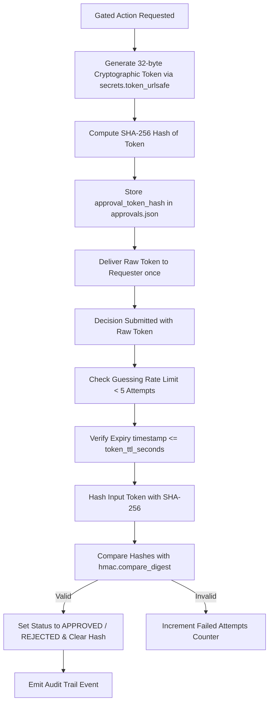

# Cryptographic Approval Security Architecture

## 1. Overview & Status
The NEXUS Approval Subsystem manages human-in-the-loop and policy-driven gates for high-risk operations. It provides cryptographic token guarantees, storage hashing, brute-force guessing protection, expiration handling, and replay prevention.

- **Status**: REAL
- **Entropy Generation**: REAL (32-byte cryptographic tokens)
- **Storage Hashing**: REAL (SHA-256)
- **Brute-Force Rate Limiting**: REAL (Blocked after 5 failed attempts)
- **TTL Expiry Handling**: REAL (600s default, explicit `EXPIRED` status)
- **Replay Protection**: REAL (One-time use)
- **Concurrency Safety**: REAL (`threading.Lock` concurrency guard)

## 2. Cryptographic Token Lifecycle

## 3. Defense Mechanisms

### 3.1. Zero Plaintext Token Storage
Tokens are generated using `secrets.token_urlsafe(32)` providing 256 bits of cryptographic entropy. The plain token is returned once during creation. The backing store (`approvals.json`) persists only the SHA-256 digest (`approval_token_hash`). Compromise of the persistence layer does not grant approval decision capabilities.

### 3.2. Expiration (TTL) Enforcement
Every approval request contains an `expires_at` UTC timestamp computed as `created_at + token_ttl_seconds` (default: 600 seconds).
If an evaluation occurs after expiration:
- The status is immediately updated to `EXPIRED`.
- The decision is rejected.
- An audit event is recorded.

### 3.3. Guessing / Brute-Force Rate Limiting
To prevent token enumeration attacks, every approval request tracks `failed_token_attempts`.
- If 5 failed attempts occur on an approval request, subsequent attempts are rejected with `HTTP 429 Too Many Requests / Guessing Blocked`.

### 3.4. Replay Prevention
Once an approval is decided (`APPROVED` or `REJECTED`), its status cannot transition again. Any secondary attempt to decide or execute an approved request is rejected with `ALREADY_PROCESSED`.

### 3.5. Action and Actor Binding
Approvals are bound to specific `actor`, `action`, and `target` properties:
- An approval generated for `agent-dev` cannot be redeemed by another agent.
- An approval generated for `git.branch` cannot be applied to `shell.safe`.

### 3.6. Concurrency Safety
The approval engine wraps all state modifications in a reentrant lock (`threading.Lock`), ensuring thread safety across concurrent API workers and asynchronous agent runs.
